# THE FROZEN HEART QUIZ

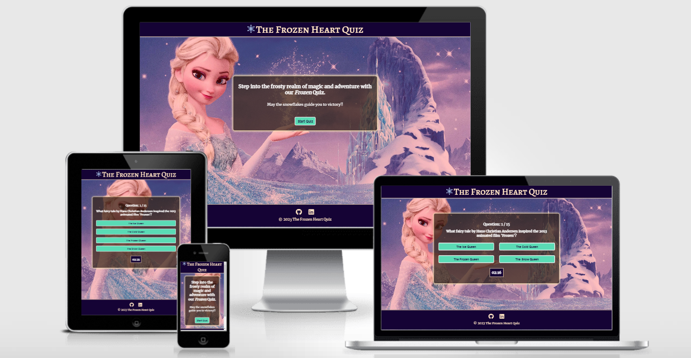

#### [The live website link](https://gayatrig19.github.io/the-frozen-heart-quiz/)

# Purpose

The Frozen Heart Quiz is an online multiple-choice quiz game website focused on the "Frozen" and "Frozen 2 " movie themed questions. The quiz is targeted towards the people (adults and children) who not only love Frozen movie but also love to explore facts about Disney movies.

- This 15 questions quiz will help you test your knowledge about the movie and actually let you know whether you are true fan of Disney movie, Frozen. The website uses clean, simple design with images and colour palette based on actual movie effect design for better user experience and entertainment. The website is fully responsive on mobile phones, tablet and desktop.
- The Frozen Heart Quiz website/game is build using HTML, CSS and JavaScript as a Milestone Project#2 for the Code Institute's Full Stack Software Development Course.

-----

# User Experience (UX)  and Design

## User Stories

- As a user, I want to see an image that clearly shows what the quiz is about and the main purpose of the site.
- As a user, I want to easily navigate through the site and find the quiz content.
- As a user, I want to have an interactive button option to start the quiz.
- As a user, I want to see which question I am on and the time taken to answer the questions.
- As a user, I want to see the questions and the options I get with it.
- As a user, I want to see if the answer I have chosen is right or wrong before moving on to the next question.
- As a user, I want to see my final score with total time taken and an option to play again.
  
#### All the users want to be able to access and view the website comfortably on mobile, tablet and desktop devices

## Design

### Wireframes

#### **Large to Medium Screen Size**

The heading in the header section of the website is capitalized with hover effect for better readability and user experience.

### **Home Page**

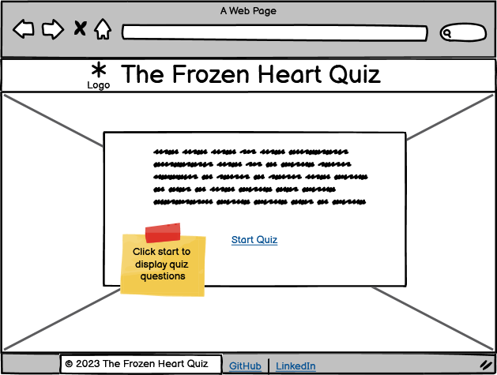

### **Quiz Game Page**

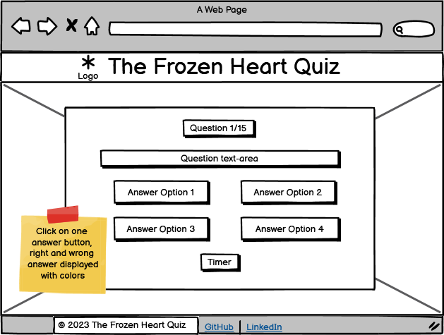

### **Quiz Score Page**

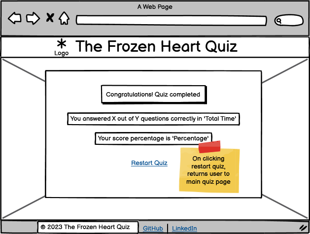

### **404-Error Page**

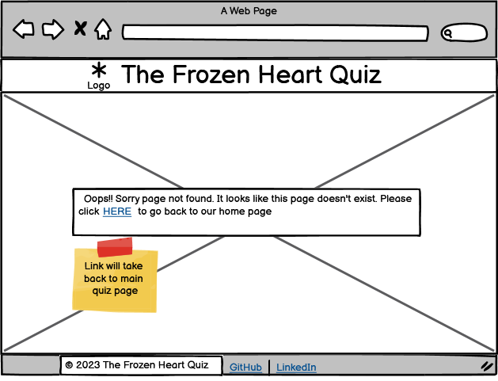

#### **Small Screen Size**

### **Home Page and Quiz Game Page**

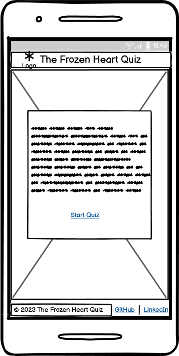   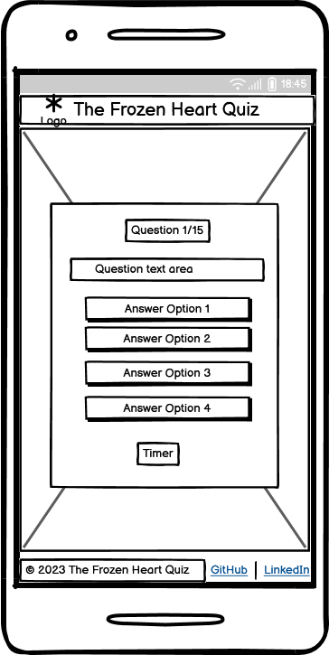

### **Quiz Score Page and 404-Error Page**

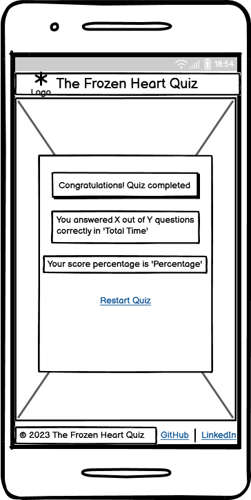  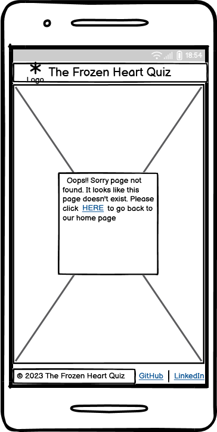

### Typography

The fonts for the website is taken from [google fonts.](https://fonts.google.com/)

- [Alegreya SC](https://fonts.google.com/specimen/Alegreya+SC?query=Alegreya+Sc) was used for the header the footer.
- [Merriweather](https://fonts.google.com/specimen/Merriweather?query=Merr) was used for the body.

### Images

- The image in this project is sourced from [WallpaperAccess](https://wallpaperaccess.com/). Image was specifically selected to correlate with the main purpose of the website and to give user a imagery representation for the content to increase the impact of the design.
- The logo image for the website is sourced from [Freepik.](https://www.freepik.com/)

### Visual Effects

#### Hover and Shadow Effect for text and buttons

- The main heading of the website and "Frozen" text on home page is given hover and shadow effects to make the user experience more interactive.
- The buttons on all pages have a transition, hover and shadow effect. When user clicks or hovers over the button a transition effect with colour change is experienced.
- The header, footer and main quiz game container includes a shadow effect for letting user get the feel of the website and relate to the content with some entertainment.

-----

# Features

## Existing Features

### Main Header

- The main header with logo image is shown on every page centered on top of the page for consistent design.
- The header includes a link which user can use if they want to be taken back to home page. The link allows user to easily navigate through the page making the site more interactive.
- When the header text is hovered over, it will change the colour with a shadow effect, so that the user will be aware of the link. The header is responsive throughout all devices from small screens, tablets to desktop.
  
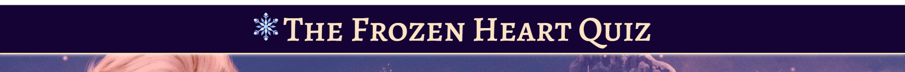

### The Home Page

- The home page contains background image with a gradient effect and a simple overlay text block with a catchy welcome message.
- In the main welcome message "Frozen" text when hovered changes colour and displays a shadow effect.
- The overlay block is same throughout the website with a shadow effect for better user experience.
- The start button on home page when clicked starts the quiz and takes the user to the main quiz section.
  
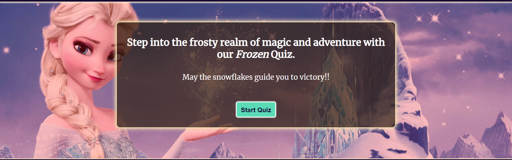

### The Quiz Game Section

- This is the section where the user will be able to see questions and answer options with a timer. The user will see total number of questions to be attempted in quiz with a timer which gives user time taken to answer the quiz questions on completing the quiz.
- The user will be able to select correct answer. The answer if correct will be highlighted in green colour and the wrong answer with red colour. The user will be automatically taken to the next question on every answer clicked.
  
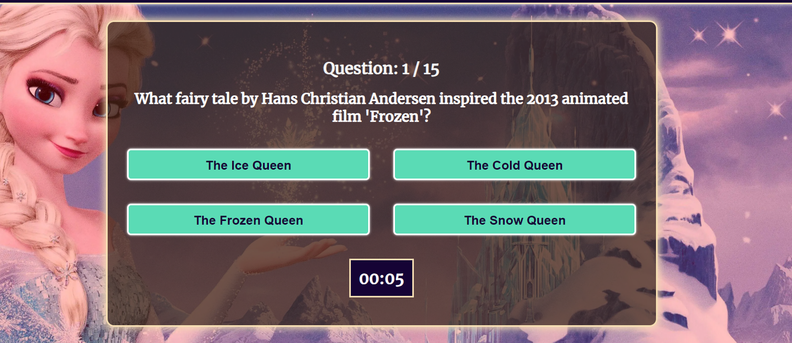

### The Score Section

- This section will tell the user exactly how many questions are answered correctly and the total time taken to complete the quiz. It will also display the total score percentage.
- A restart quiz button on the page will take the user back to home page if user wants to retry the quiz.
- The design is simple so that user will be able to understand the interactivity and actions to take on every step.

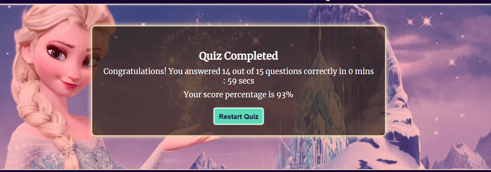

### The Footer Section

- Similar to the main header, the footer shows on every page below the game section on the website. It displays icon links to GitHub and LinkedIn accounts. These icon links can enable user to see more about my work through GitHub and learn more about me through LinkedIn.
- The footer also displays a copyright for the website with simple design consistency throughout all devices.

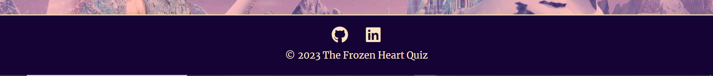

### The 404-Error Page

- This page will show to user if a wrong link for the page is entered.
- The design for the page is simple stating the message.
- This page gives a clear instructions with the link to go back to home page. The user will not have to use the browser's back button and can navigate through website without leaving it.

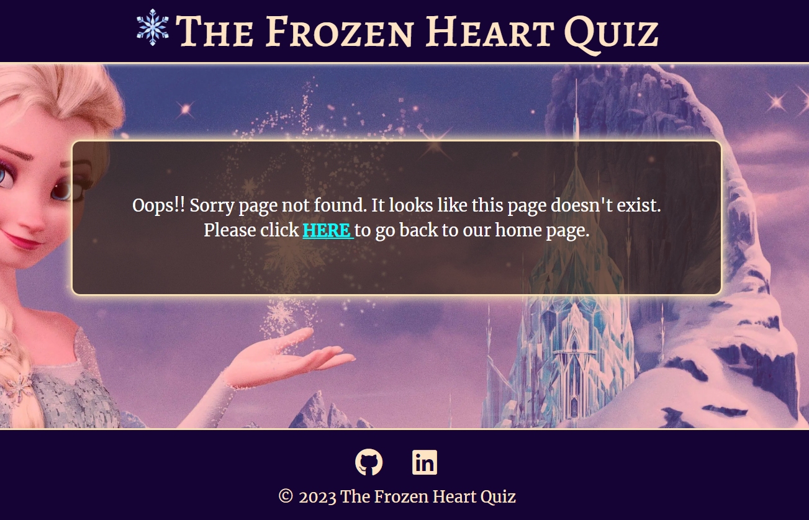

### Features left to implement

- The user-name input and validation feature so that the user can enter his/her name before starting the quiz, the name will be saved for later use to display the score.
- A leaderboard to save the user's previous scores.
- Create an option in the quiz for different difficulty levels for better user experience and entertainment.
  
----

## Testing

### Responsiveness

- The site is designed to be flexible, fluid and responsive on all screen sizes. Website have been checked for responsiveness through Chrome Development tools. In order to do this, the following steps are taken:
  1. Open the browser.
  2. Navigate to The FROZEN HEART QUIZ website <https://gayatrig19.github.io/the-frozen-heart-quiz/>
  3. Right click anywhere on the page and go to "Inspect" to open Development Tools.
  4. Click on drop down menu: "Dimensions: Responsive" and choose "Responsive".
  5. Drag the side of the screen and change screen size, making sure the website looks good from 320px and up. Here, ensure there is consistency in design of the website on every screen size from small(mobile devices) to larger(desktop devices) and no scorll bar is showing for layout of site.

- Expected Result: Each page section is responsive and user friendly when viewing the website on small and large screens.The website have no design or accessibility issue in any of the screen sizes from 320px and up.
- Actual Result: After using media queries targeted to specific screen sizes, website is responsive with no scroll bar showing, the content is accessible to user to read. Website is user friendly on small to large screen sizes.

- The following devices are used to check responsiveness of the website:
  - Samsung S20 FE 5G
  - Samsung Galaxy A50s
  - Iphone 12
  - Microsoft Surface Pro
  - Apple ipad Air
  - Google Pixel 5

### Accessibility

- Each page is checked with the help of WAVE Accessibility tool (<https://wave.webaim.org/>)
- Each page passes accessibility test with no error for:
      - contrast
      - aria- labels for users who use screen-readers.
      - alternative text as a function for screen readers or in events if the images don't load.
      - structural elements: for users of assistive technology as well as visual and semantic meaning.
      - language of the document for screen readers.
      - an alert coming up due to noscript tag and possible heading h2 used on home page, however as it doesn't come up as an error, I have left it in with no modifications

- Accessibility test result for [website](assets/images/readme/wave_accessibility_test.png)

### Manual Testing

Manual testing is performed to ensure website performs well on different browsers and devices.

- Testing for different browsers was carried on using [BrowserStack](https://www.browserstack.com/?utm_source=google&utm_medium=cpc&utm_platform=paidads&utm_content=668760067900&utm_campaign=Search-Brand-EMEA-Navigational&utm_campaigncode=Core+1006598&utm_term=e+browserstack) and manually on some of the browsers.
  - Chrome
  - Safari
  - Microsoft Edge
  - Firefox
  - Internet Explorer

- No issue was detected in the website while cross-browser testing. The website is fully responsive on the mentioned browsers.
- For testing on different devices the website link was shared with my friends and family. The website was fully responsive with no issues on following devices:
  
  - Samsung S20 FE 5G
  - Samsung Galaxy A50s
  - Iphone 12
  - One Plus Nord CE
  - Microsoft Surface Pro
  - Apple ipad Air
  - Moto G

### Lighthouse

- Lighthouse Score for Desktop:
  
  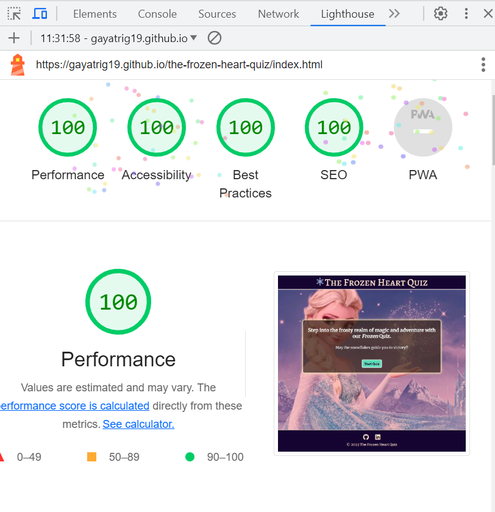

- Lighthouse Score for Mobile:

  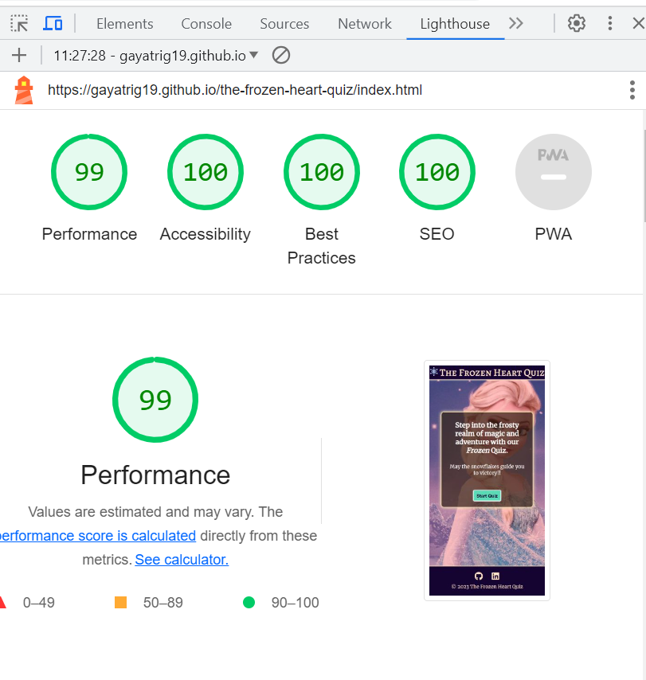

### Functional Testing

- Buttons and anchor links
  - All links and buttons checked and works as expected
  
  | Button / anchor link (Location)            |  Destination Page                     | Page Opens In New Tab |
  |---------------------------------------------|---------------------------------------|-----------------|
  | "Start Quiz" (home page)                    | index.html / 1st question displayed   | no - as expected |
  |"Answer button" (answer is selected)         | index.html /  next question displayed  | no - as expected|
  | "Restart Quiz" (index.html / displayed below final score)| index.html / home page with "Start Quiz" displayed | no - as expected |
  | Home Page / Quiz Section link (Header link) | index.html                             | no - as expected |
  | "GitHub" icon (footer section)               |  <https://github.com/gayatrig19>        |  yes - as expected |
  | "LinkedIn" icon (footer section)             |  <https://www.linkedin.com/in/gayatri-ghogare-a8099692/> | yes - as expected  |

- Functionality Testing
  - As a user I have tested website as follows:

     1. Home Page / index.html:
          - User clicks on "Start Quiz" button, user is taken to the quiz game section. The timer starts   and the questions with answer options and question number is displayed.
     2. Quiz Game Section / index.html:
           - User selects one of the answer options, if the answer is correct, the button is highlighted  in green colour.
           - If the selected answer is wrong, the button is highlighted in red colour and simultaneously correct ones is highlighted with green colour.
           - With each answer button selected next question is displayed. The question is incremented by 1.
     3. Score Section / index.html:
           - User completes the 15 qustions of quiz, final score with number of correct question answered and time taken to complete the quiz is displayed.
         - User clicks on the "Restart Quiz" button, user is taken back to home page with "Start Quiz" button and welcome message displayed.

     4. All the hover and shadow effects on text and buttons works as expected.

### Validator Testing

- HTML Validation
  - No errors were found when passing through the official W3C Validator

    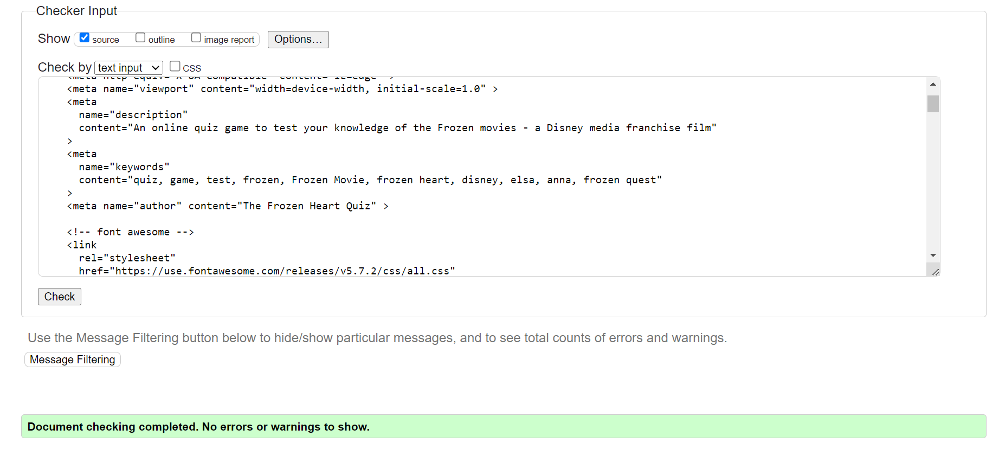

- CSS Validation
  - No errors were found when passing through the official Jigsaw W3 Validator

   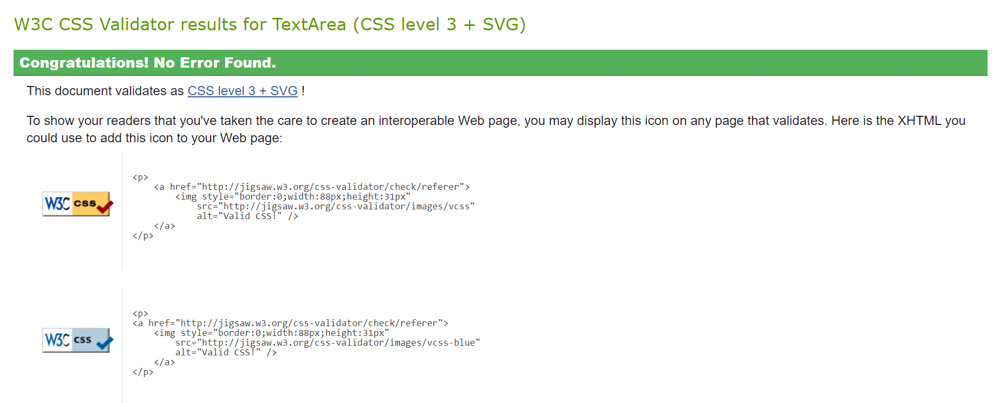

- JavaScript Validation
  - No errors were found when passing through the jshint validator.

   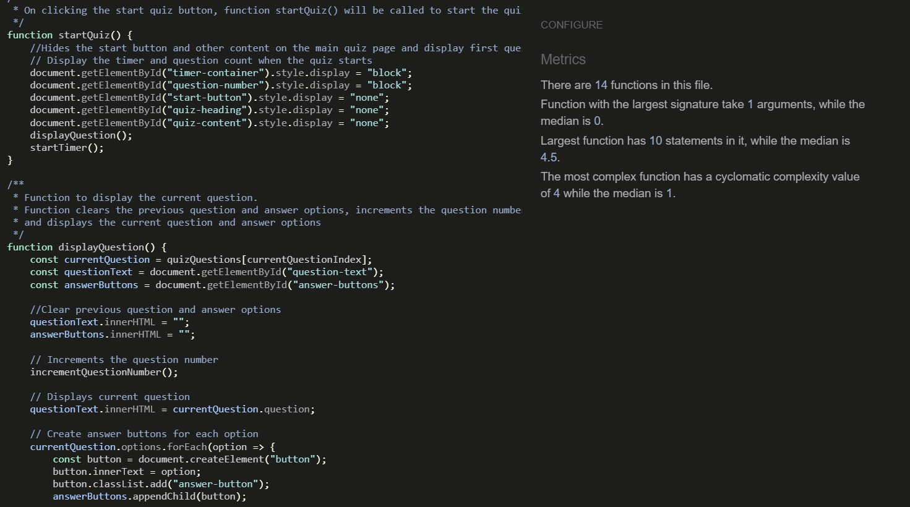

### Unfixed Bugs

- No bugs where detected while testing the website on browsers and devices(small, medium and large screen sizes). All pages are fully functional and responsive to the browers and devices. The consistency in design is maintained throughout.

## Version Control

The website was developed through Codeanywhere IDE.

Code has been pushed to repository on Github with following git commands:

- git add . - to add files ready to commit
- git commit -m "message" - to commit the code to local repository ready to be pushed
- git push - final command used to push committed code to remote repo on Github

## Cloning the Repository

1. On Github navigate to the repository "gayatrig19/the-frozen-heart-quiz"
2. Click "Code" drop down menu - a green button shown right above the file list.
3. Copy the URL of the repository using "HTTPS", "SSH" or "Github CLI".
4. Open Git Bash.
5. Change the current working directory to the location where you want the cloned directory.
6. Type "git clone", and then paste the URL copied earlier.
7. Press enter to create local clone. A clone of the repository will now be created.

- For more details on how to clone the repository in order to create a copy for own use refer to the site:<https://docs.github.com/en/repositories/creating-and-managing-repositories/cloning-a-repository>

## Forking

1. On Github navigate to the repository "gayatrig19/the-frozen-heart-quiz"
2. Click "Fork" located towards top right corner on GitHub page.
3. Select "owner" for the forked repository from the dropdown menu under "owner".
4. It will create forked repo under the same name as original by default. But you can type a name in "Repository name" or add a description in "Description" box.
5. Click on "Create fork". A forked repo is created.

- Forking allows you to make any changes without affecting original project. You can send the suggestions by submitting a pull request. Then the Project Owner can review the pull request before accepting the suggestions and merging them.
- When you have fork to a repository, you don't have access to files locally on your device, for getting access you will need to clone the forked repository.

## Deployment

- The website was deployed to Github Pages using following steps:
  
1. Go to GitHub repository.
2. Click on "Settings".
3. Click on "Pages"(tab on the left sidebar).
4. Scroll to "Build and deployment"/"Source" section.
5. Find the sub-section "Branch".
6. From the drop-down menu "none"/"select branch" and choose source "main" (or "master").
7. Click 'Save'
8. Wait until you can see a link for deployed page within GitHub Page section. This can take a while. Once the page updates you will see a message: Your site is live at <https://gayatrig19.github.io/the-frozen-heart-quiz/>

# Technologies

- HTML - used to create the main structure of the website.
- CSS - used to style the website.
- JavaScript - used to create dynamic content and make page interactive
- Codeanywhere built-in formatter to format structure for HTML and CSS files in the project.
- [Codeanywhere](https://app.codeanywhere.com/) IDE to develop the website.
- [GitHub](https://github.com/) to host the source code and GitHub Pages to deploy and host the live site.
- Git to provide the version control to commit and push code to the repository.
- [Google Fonts](https://fonts.google.com/) for typography.
- [FontAwesome](https://fontawesome.com/v5/search) v5.15.4 for icons.
- Google Chrome Dev Tools for inspecting, debugging pages and testing layouts.
-[Pixelied](https://pixelied.com/) to convert .jpg images into .webp to reduce storage and enhance the website performance.
- [TinyJPG](https://tinyjpg.com/) to optimise images for website.
- [Freepik](https://www.freepik.com/) to source the main logo image.
- [WallpaperAccess](https://wallpaperaccess.com/) to source the website background image.
- [Favicon.io](https://favicon.io/) to create the website favicon.
- Balsamiq to design the wireframes for the website.
- [Am I Responsive](http://amiresponsive.blogspot.com/) to create the Mockup image in this README.
- Google Chrome's Lighthouse to test accessibility for desktop and mobile devices.
- [WAVE](https://wave.webaim.org/) evaluation tool to test the website for accessibility to individuals with disabilities.
- [W3C HTML Markup Validator](https://validator.w3.org/) to validate the HTML Code.
- [W3C Jigsaw CSS Validator](https://jigsaw.w3.org/css-validator/) to validate the CSS Code.
- [jshint validator](https://jshint.com/) - used to check java script code for errors.
- Code Institute's Codeanywhere Template to generate the workspace for the project.
